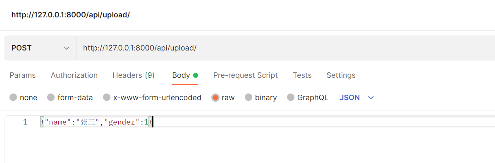
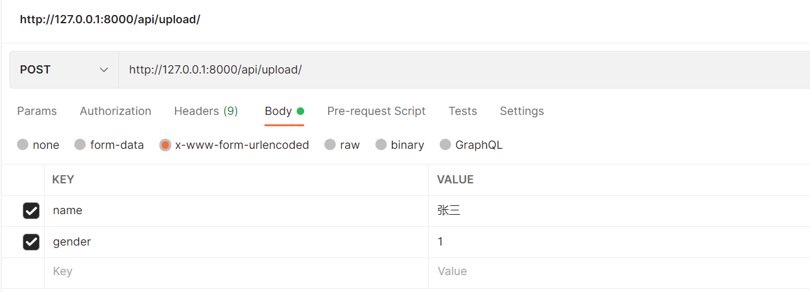
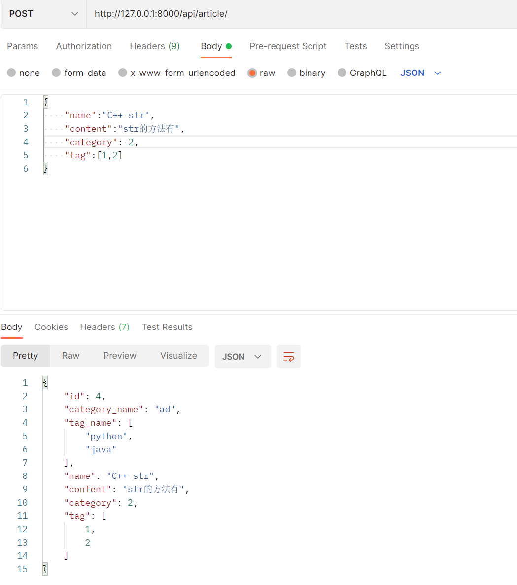
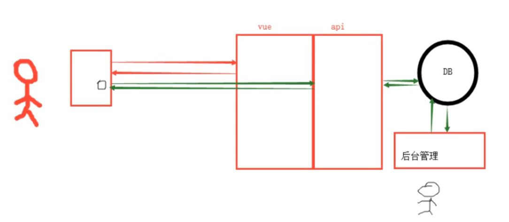
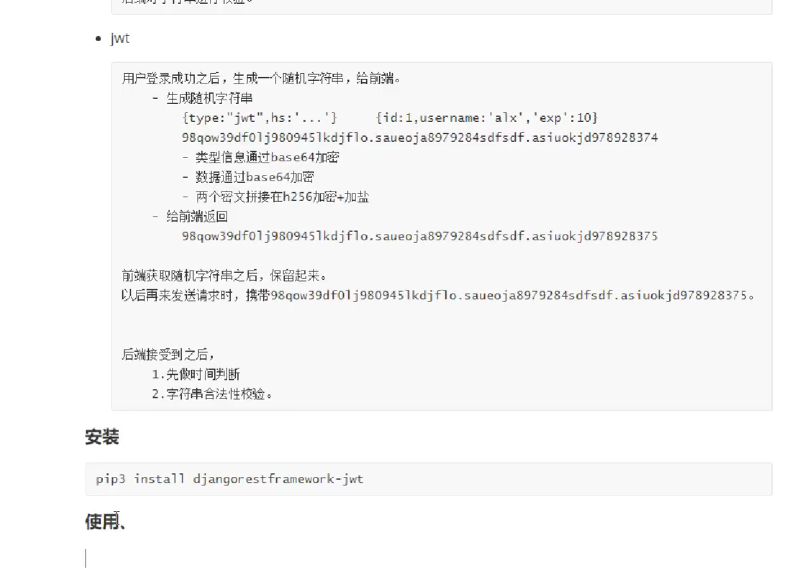
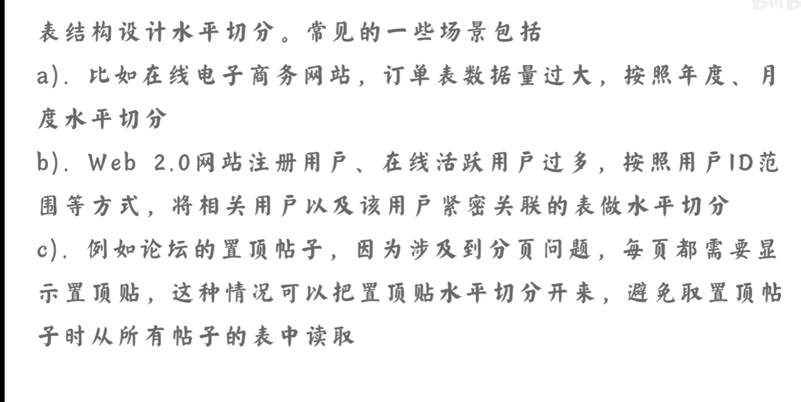
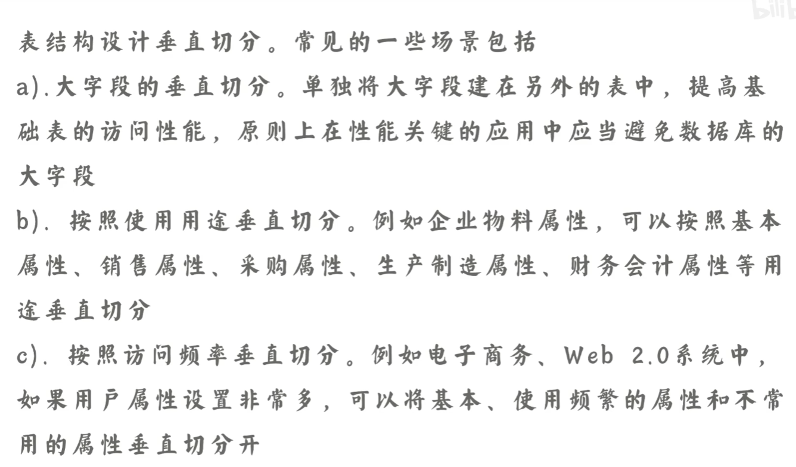

## 一对多

models.ForeignKey(to='Category', on_delete=models.CASCADE)

注意加上引号和on_delete

```python
from django.db import models

# Create your models here.
class Category(models.Model):
    '''
    类别
    '''
    name = models.CharField(verbose_name='类别', max_length=32)


class Article(models.Model):
    '''
    文章
    '''
    name = models.CharField(verbose_name='标题', max_length=32)
    content = models.TextField(verbose_name='内容')
    category = models.ForeignKey(to='Category', on_delete=models.CASCADE)
```

## POST请求,推荐使用request.data获取数据

原始做法，只能使用body、POST、GET

```
application/x-www-form-urlencoded
使用request.POST.get

application/json
使用json.loads(request.body.decode('utf8'))

multipart/form-data
使用request.POST.get
```

使用drf后

### 使用json格式上传， request.data



```
print(request.body)
print(request.POST)
print(request.data)
```


```
b'{"name":"\xe5\xbc\xa0\xe4\xb8\x89","gender":1}'
<QueryDict: {}>
{'name': '张三', 'gender': 1}
```

### x-www-form-urlencoded格式，使用request.data.dict()



```
b'name=%E5%BC%A0%E4%B8%89&gender=1'
<QueryDict: {'name': ['张三'], 'gender': ['1']}>
<QueryDict: {'name': ['张三'], 'gender': ['1']}>
```

## url

re_path：?P<value>的意思就是命名一个名字为value的组，匹配规则符合后面的/d+

一定要使用 ^开头，$结尾，不然会出现未知的bug

```
re_path(r'^category/(?P<pk>\d+)/$', CategoryView.as_view()),
```

## serializer 

+ 序列化
+ 验证数据

```python
class NewCatagory(APIView):
    def get(self, request, *args, **kwargs):
        pk = kwargs.get('pk')
        if pk:
            obj =models.Category.objects.filter(pk=pk).first()
            # 序列化的数据，instance传入
            ser = NewCatagorySerializer(instance=obj)
            return Response(ser.data)
        else:
            obj = models.Category.objects.all()
            ser = NewCatagorySerializer(instance=obj, many=True)
            return Response(ser.data)

    def post(self, request, *args, **kwargs):
        # 反序列化数据，data传入
        ser = NewCatagorySerializer(data=request.data)
        if ser.is_valid():
            ser.save()
            return Response(ser.data)
        else:
            return Response(ser.errors)

    def put(self, request, *args, **kwargs):
        '''
        全部更新，全部字段都需要传
        '''
        pk = kwargs.get('pk')
        obj = models.Category.objects.filter(pk=pk).first()
        # 修改数据，两者均传入
        ser = NewCatagorySerializer(instance=obj, data=request.data)
        if ser.is_valid():
            ser.save()
            return Response(ser.data)
        return Response(ser.errors)
    
    def patch(self, request, *args, **kwargs):
        '''
        局部更新，partial=True
        '''
        pk = kwargs.get('pk')
        obj = models.Category.objects.filter(pk=pk).first()
        # 修改数据，两者均传入
        ser = NewCatagorySerializer(instance=obj, data=request.data, partial=True)
        if ser.is_valid():
            ser.save()
            return Response(ser.data)
        return Response(ser.errors)
    
    def delete(self, request, *args, **kwargs):
        pk = kwargs.get('pk')
        models.Category.objects.filter(pk=pk).delete()
        return Response("删除成功")
```

### serializer增加字段显示

+ 使用get_xx_display，xx为原始model中的属性，显示其choice文本信息（普通用户）。
+ 使用属性的子属性。user.username
+ 跨表查询（通常没有跨表的对象直接调用，跟方法2不同）。表名的小写.属性
+ 使用SerializerMethodField()，其中需要定义get_xx方法，其中obj为model应该返回的数据。

depth默认为0，为1可以显示关联表的信息

```python
class UserInfo(models.Model):
    user_type_choice = (
        (1, '普通用户'),
        (2, 'VIP'),
        (3, 'SVIP'),
    )
    user_type = models.IntegerField(choices=user_type_choice)
    username = models.CharField(max_length=32, unique=True)
    password = models.CharField(max_length=64)
    group = models.ForeignKey(to='UserGroup', on_delete=models.CASCADE)  # 一对多
    roles = models.ManyToManyField(to='Role')  # 多对多

```

```python
class UserInfoModelSerializer(serializers.ModelSerializer):
    type = serializers.CharField(source='get_user_type_display',required=False)
    class Meta:
        model = UserInfo
        fields = '__all__'
        depth = 1
```

多对多

+ 可以使用不同的serializer获取数据
+ 注意传入方式：多对多属性

```python

class Category(models.Model):
    '''
    类别
    '''
    name = models.CharField(verbose_name='类别', max_length=32)


class Article(models.Model):
    '''
    文章
    '''
    name = models.CharField(verbose_name='标题', max_length=32)
    content = models.TextField(verbose_name='内容')
    category = models.ForeignKey(to='Category', on_delete=models.CASCADE)
    tag = models.ManyToManyField(to='Tag', verbose_name='标签', blank=True, null=True, default=None)


class Tag(models.Model):
    label = models.CharField(verbose_name='标签', max_length=32)

```

```python

class ArticleSerializer(serializers.ModelSerializer):
    category_name = serializers.CharField(source='category.name', required=False)
    tag_name = serializers.SerializerMethodField(required=False)

    class Meta:
        model = models.Article
        fields = '__all__'
        # depth = 1

    def get_tag_name(self, row):
        tags = row.tag.all()
        res = []
        for tag in tags:
            res.append(tag.label)
        return res


class GetArticleSerializer(serializers.ModelSerializer):
    class Meta:
        model = models.Article
        fields = ['name', 'tag']


class Article(APIView):
    def get(self, request, *args, **kwargs):
        pk = kwargs.get('pk')
        if pk:
            obj = models.Article.objects.filter(pk=pk).first()
            # 序列化的数据，instance传入
            ser = GetArticleSerializer(instance=obj)
            return Response(ser.data)
        else:
            obj = models.Article.objects.all()
            ser = GetArticleSerializer(instance=obj, many=True)
            return Response(ser.data)

    def post(self, request, *args, **kwargs):
        # 反序列化数据，data传入
        print(request.data)
        ser = ArticleSerializer(data=request.data)
        if ser.is_valid():
            ser.save()
            return Response(ser.data)
        else:
            return Response(ser.errors)

    def put(self, request, *args, **kwargs):
        '''
        全部更新，全部字段都需要传
        '''
        pk = kwargs.get('pk')
        obj = models.Article.objects.filter(pk=pk).first()
        # 修改数据，两者均传入
        ser = ArticleSerializer(instance=obj, data=request.data)
        if ser.is_valid():
            ser.save()
            return Response(ser.data)
        return Response(ser.errors)

    def patch(self, request, *args, **kwargs):
        '''
        局部更新，partial=True
        '''
        pk = kwargs.get('pk')
        obj = models.Article.objects.filter(pk=pk).first()
        # 修改数据，两者均传入
        ser = ArticleSerializer(instance=obj, data=request.data, partial=True)
        if ser.is_valid():
            ser.save()
            return Response(ser.data)
        return Response(ser.errors)

    def delete(self, request, *args, **kwargs):
        pk = kwargs.get('pk')
        models.Article.objects.filter(pk=pk).delete()
        return Response("删除成功")
```

postman 传入方式



## 分页

主要使用page和offset

```python
from rest_framework.pagination import PageNumberPagination

class GetArticleSerializer(serializers.ModelSerializer):
    class Meta:
        model = models.Article
        fields = '__all__'

class PageArticle(APIView):
    def get(self, request, *args, **kwargs):
        queryset = models.Article.objects.all()
        pg = PageNumberPagination()
        res = pg.paginate_queryset(queryset, request, self)
        ser = GetArticleSerializer(instance=res, many=True)
        return Response(ser.data)

# setting.py    
REST_FRAMEWORK = {
    'DEFAULT_PAGINATION_CLASS': 'rest_framework.pagination.PageNumberPagination',
    'PAGE_SIZE': 2,
}

```

## 类继承潜规则

遇见父类有这种raise函数，例如抛出NotImplementedError异常，则需要继承类重写，实现该函数功能。

```python
def paginate_queryset(self, queryset, request, view=None):  # pragma: no cover
        raise NotImplementedError('paginate_queryset() must be implemented.')
```

## 呼啦圈设计

### 1.1、表结构设计

+ 不会经常变化的值放在内存：choice形式，避免跨表查询，降低性能
+ 分表：如果表中的数据太多，可以选择水平分表。
+ 表自关联

```python
'''
呼啦圈表设计
表：
用户：用户名、密码
评论: 时间、父评论（自关联）、归属文章：评论 1：n、评论者（用户）：评论 1：n
文章: 作者（用户)：文章 1：n 、时间、分类、标题、内容、简介、评论数、浏览数
'''


class UserInfo(models.Model):
    '''用户表'''
    username = models.CharField(verbose_name='用户名', max_length=32)
    password = models.CharField(verbose_name="密码", max_length=64)


class Article(models.Model):
    '文章表'
    category_choices = (
        (1, '咨询'),
        (2, '公司动态'),
        (3, '分享'),
        (4, '答疑'),
        (5, '其他'),
    )
    category = models.CharField(verbose_name='分类', choices=category_choices)
    title = models.CharField(verbose_name='标题', max_length=255)
    image = models.CharField(verbose_name='图片路径', max_length=128)
    summary = models.CharField(verbose_name='简介', max_length=255)
    comment_count = models.IntegerField(verbose_name='评论数', default=0)
    read_count = models.IntegerField(verbose_name='阅读数', default=0)
    data = models.DateTimeField(verbose_name='创建时间', auto_now_add=True)

    author = models.ForeignKey(
        to='UserInfo', verbose_name='作者', on_delete=models.CASCADE)


class Comment(models.Model):
    '评论表'
    content = models.TextField(verbose_name='评论')

    article = models.ForeignKey(
        verbose_name='文章', to='Article', on_delete=models.CASCADE)
    user = models.ForeignKey(
        verbose_name='评论者', to='UserInfo', on_delete=models.CASCADE)
    parent = models.ForeignKey(
        verbose_name='父评论', to='self', null=True, blank=True, default=None)

```

### 1.2、系统结构



### 1.3、功能实现

1.3.1 增加文章 （可以不写）

1.3.2 文章列表

1.3.3 文章详细

1.3.4 文章评论

+ 查看评论列表
```
访问时：
http://127.0.0.1:8000/art/comment/?article=1
```
+ 添加评论

```
http://127.0.0.1:8000/art/comment/
{
  "article":1,
  "content":"x"
}
```

```python
# Create your views here.
from rest_framework import serializers
from rest_framework.pagination import PageNumberPagination
from rest_framework.response import Response
from rest_framework.views import APIView

from . import models


class ArticleSerializer(serializers.ModelSerializer):
    class Meta:
        model = models.Article
        exclude = ['author', ]  # 后台会自带session或者id传入，不用验证


class ArticleDetailSerializer(serializers.ModelSerializer):
    class Meta:
        model = models.ArticleDetail
        exclude = ['article', ]  # 文章验证成功后会生成id，无需传入


class ArticleListSerializer(serializers.ModelSerializer):
    class Meta:
        model = models.Article
        fields = '__all__'


class PageArticleSerializer(serializers.ModelSerializer):
    content = serializers.CharField(source='articledetail.content', required=False)
    author = serializers.CharField(source='author.username', required=False)
    category = serializers.CharField(source='get_category_display', required=False)

    class Meta:
        model = models.Article
        fields = '__all__'


class ArticleView(APIView):
    def get(self, request, *args, **kwargs):
        '''获取文章'''
        pk = kwargs.get('pk')
        if not pk:  # 获取概要
            queryset = models.Article.objects.all().order_by('-date')
            page = PageNumberPagination()
            res = page.paginate_queryset(queryset, request, self)
            ser = ArticleListSerializer(instance=res, many=True)
            return Response(ser.data)

        article_obj = models.Article.objects.filter(id=pk).first()
        ser = PageArticleSerializer(instance=article_obj)
        return Response(ser.data)

    def post(self, request, *args, **kwargs):
        '''新增文章，应该在后台管理开发实现'''
        '''http://127.0.0.1:8000/art/article/
        {
            "category":1,
            "title":"新闻",
            "image":"xxx",
            "summary":"简介",
            "content":"内容"
        }
        无需传入user，通过用户验证时，通过session自动获取
        '''
        ser = ArticleSerializer(data=request.data)
        ser_detail = ArticleDetailSerializer(data=request.data)

        if ser.is_valid() and ser_detail.is_valid():
            article_obj = ser.save(author_id=1)
            ser_detail.save(article=article_obj)
            return Response('增加成功')

        return Response(ser.errors)


class CommentSerializer(serializers.ModelSerializer):
    class Meta:
        model = models.Comment
        fields = "__all__"


class PostCommentSerializer(serializers.ModelSerializer):
    class Meta:
        model = models.Comment
        exclude = ['user', ]


class CommentView(APIView):
    def get(self, request, *args, **kwargs):
        '''评论列表，comment/?article=1'''
        article_id = request.query_params.get('article')
        queryset = models.Comment.objects.filter(article_id=article_id)
        ser = CommentSerializer(instance=queryset, many=True)
        return Response(ser.data)

    def post(self, request, *args, **kwargs):
        '''添加评论， 无需传入user，通过用户验证时，通过session自动获取'''
        '''
        http://127.0.0.1:8000/art/comment/
        {
            article:1,
            content:xxx,
        }
        '''
        ser = PostCommentSerializer(data=request.data)
        if ser.is_valid():
            ser.save(user_id=1)
            return Response(ser.data)
        return Response(ser.errors)

```

## 2、筛选

案例：在文章列表的时候，添加筛选功能

```
全部：http://127.0.0.1:8000/art/article/
筛选：http://127.0.0.1:8000/art/article/?category=1
```

```python
class ArticleView(APIView):
    def get(self, request, *args, **kwargs):
        '''获取文章'''
        pk = kwargs.get('pk')
        if not pk:  # 获取概要
            condition = {}  # 筛选类别
            category = request.query_params.get('category')
            if category:
                condition['category'] = category
            queryset = models.Article.objects.filter(**condition).order_by('-date')
            page = PageNumberPagination()
            res = page.paginate_queryset(queryset, request, self)
            ser = ArticleListSerializer(instance=res, many=True)
            return Response(ser.data)

        article_obj = models.Article.objects.filter(id=pk).first()
        ser = PageArticleSerializer(instance=article_obj)
        return Response(ser.data)
```

使用BaseFilterBackend

```python
from rest_framework.generics import ListAPIView, CreateAPIView
from rest_framework.filters import BaseFilterBackend


class CommentFilterBackend(BaseFilterBackend):
    def filter_queryset(self, request, queryset, view):
        article_id = request.query_params.get('article', None)
        if not article_id:
            # 返回空的queryset
            return queryset.none()
        return queryset.filter(article_id=article_id)


class CommentView(ListAPIView, CreateAPIView):
    '''评论相关接口'''

    queryset = models.Comment.objects.all()
    filter_backends = [CommentFilterBackend, ]

    def get_authenticators(self):
        if self.request.method == "GET":
            return []
        elif self.request.method == "POST":
            return [auth.HulaQueryParamAuthentication(), ]

    def get_serializer_class(self):
        if self.request.method == "GET":
            return CommentListSerializers
        return CommentCreateSerializers

    def perform_create(self, serializer):
        '''适用于保存comment，增加user数据'''
        print(self.request.user)
        serializer.save(user=self.request.user)
```

drf 通用筛选

```
安装 pip install django-filter

全局配置
REST_FRAMEWORK = {
    'DEFAULT_FILTER_BACKENDS': ('django_filters.rest_framework.DjangoFilterBackend',),
}

使用
from django_filters.rest_framework import DjangoFilterBackend


class NewCommentView(ListAPIView):
    queryset = models.Comment.objects.all()
    serializer_class = CommentSerializer
    pagination_class = PageNumberPagination
    filter_backends = [DjangoFilterBackend, ]
    filterset_fields = ['article', 'content', ] #过滤字段
```


## 3、视图

可以通过使用不同请求方式，来使用不同的serializer，重写保存方法

```python
from rest_framework.generics import ListAPIView, CreateAPIView, UpdateAPIView, DestroyAPIView, GenericAPIView

class NewCommentView(ListAPIView, CreateAPIView):
    queryset = models.Comment.objects.all()
    pagination_class = PageNumberPagination
    filter_backends = [DjangoFilterBackend, ]
    filterset_fields = ['article', 'content', ]
    
 
    def get_serializer_class(self):
        if self.request.method == "GET":
            return CommentSerializer
        elif self.request.method =="POST":
            return OtherSerializer
    
    def perform_create(self, serializer):
        serializer.save(author_id=1)
```

## 4、认证

### 4.1 认证，给request.user 赋值

```python 
class Login(APIView):
    '''通过用户名、密码登录，验证成功则生成token'''

    def post(self, request, *args, **kwargs):
        user = models.UserInfo.objects.filter(**request.data).first()
        if not user:
            return Response('登录失败')
        user.token = str(uuid.uuid4())
        user.save()
        return Response(user.token)


class Authication(BaseAuthentication):
    def authenticate(self, request):
        token = request.data.get('token')
        # 减少数据库查询压力
        if not token:
            return (None, None)

        user = models.UserInfo.objects.filter(token=token).first()
        if user:
            # rest_framework 内部会将两个字段赋给 request, 以便后续使用
            # 分别为 self.user, self.auth
            return (user, token)
        return (None, None)


class Edit(APIView):
    authentication_classes = [Authication, ]

    def get(self, request, *args, **kwargs):
        if request.user:
            return Response('登录成功')
        return Response('登录失败')
```

### 4.2权限，控制访问

```python
class MyPermission(BasePermission):
    '''登录之后才可以评论，取评论不用验证'''
    message = {'status': False, 'error': '登录之后才可以评论'}

    def has_permission(self, request, view):
        if request.user:
            return True
        if request.method == "GET":
            return True
        return False
```

## 5、跨域问题解决

添加响应头

[参考方案](https://pypi.org/project/django-cors-headers/)

[参考方案](https://blog.csdn.net/apple9005/article/details/54427902)

## 6、JWT

生成加密的字符串，传给前端，无需保存到数据库，可以跨域。

```
pip install djangorestframework-jwt
```




表直接设计成用户名、密码结构。

```
REST_FRAMEWORK = {
    'DEFAULT_AUTHENTICATION_CLASSES': (
        'rest_framework_jwt.authentication.JSONWebTokenAuthentication',
        'rest_framework.authentication.SessionAuthentication',
        'rest_framework.authentication.BasicAuthentication',
    ),
}
```

```python
class Login(APIView):
    '''通过用户名、密码登录，验证成功则生成token'''

    def post(self, request, *args, **kwargs):
        # 基于token的认证
        '''
        user = models.UserInfo.objects.filter(**request.data).first()
        if not user:
            return Response('登录失败')
        user.token = str(uuid.uuid4())
        user.save()
        return Response({'code':'1001','token':user.token})
        '''

        # 基于jwt的认证
        from rest_framework_jwt.settings import api_settings
        jwt_payload_handler = api_settings.JWT_PAYLOAD_HANDLER
        jwt_encode_handler = api_settings.JWT_ENCODE_HANDLER

        user = models.UserInfo.objects.filter(**request.data)
        if not user:
            return Response({'code': 1000, 'error': '用户名或密码错误'})
        
        payload = jwt_payload_handler(user)
        token = jwt_encode_handler(payload)
        return Response({'code': '1001', 'token': token})
```

登录认证

```python
class NewEdit(APIView):
    def get(self, request, *args, **kwargs):
        from rest_framework_jwt.settings import api_settings
        from rest_framework import exceptions
        jwt_decode_handler = api_settings.JWT_DECODE_HANDLER
        token = request.query_params.get('token')
        try:
            payload = jwt_decode_handler(token)
        except jwt.ExpiredSignature:
            msg = "签名已过期"
            raise exceptions.AuthenticationFailed(msg)
        except jwt.DecodeError:
            msg = '认证失败'
            raise exceptions.AuthenticationFailed(msg)
        except jwt.InvalidTokenError:
            msg = '认证失败'
            raise exceptions.AuthenticationFailed(msg)

        print(payload)
        return Response('认证成功')
```

## 数据库分表、分区

### 水平分表

不改变表结构，以行为单位对数据进行拆分。

#### 1、什么是水平分表
水平分表就是指以行为单位对数据进行拆分，一般意义上的分库分表指的就是水平分表。
分表之后，所有表的结构都是一样的。

#### 2、为什么要水平分表
水平分表可以解决表中的数据量大的问题，如果一张表的数据太多，操作起来会很麻烦，所以分表存储数据。

#### 3、 如何进行水平分表
一般可以有范围法和hash法来进行水平分表。
假设现在有30万行数据，需要对它们进行水平分表：
范围法很好理解，可以让第1-100000行数据存放在表1，第100001-200000行数据存放在表2，第200001-300000行数据存放在表3，就完成了水平分表。
hash法也不难理解，就是选择一个合适的hash函数，比如说使用取模操作(%)，把%3结果为0的数据存放在表1，结果为1的存放在表2，结果为2的存放在表3即可。

### 优点：

+ 不存在单表数据量过大

### 缺点

+ 跨表join关联查询性能差
+ 数据扩展和维护起来麻烦

### 垂直分表

改变表结构，将列切分开成为不同表。

 **垂直分表**是基于数据库中的"列"进行，某个表字段较多，可以新建一张扩展表，将不经常用或字段长度较大的字段拆分出去到扩展表中。

### 优点

+ 解耦，提高io效率

### 缺点

+ 存在单表数据量过大的问题
+ 事务处理变得复杂




## models.DateTimeField

**auto_now=Ture**，字段保存时会自动保存当前时间，但要注意每次对其实例执行save()的时候都会将当前时间保存，也就是不能再手动给它存非当前时间的值。
 **auto_now_add=True**，字段在实例第一次保存的时候会保存当前时间，不管你在这里是否对其赋值。但是之后的save()是可以手动赋值的。

## 视图总结

+ APIView，手动写get/post/put等方法

```python
# Create your views here.
from rest_framework.response import Response
from rest_framework.throttling import AnonRateThrottle
from rest_framework.views import APIView


class ArticleView(APIView):
    '''文章相关接口，无需登录就可以查看'''

    throttle_classes = [AnonRateThrottle, ]

    def get(self, request, *args, **kwargs):
        '''文章列表 && 文章详细'''
        return Response('无需认证')
```

+ ListAPIView、RetrieveAPIView等，内部存在get、post方法，可以直接使用。

```python
path('article/', article.ArticleView.as_view()),
re_path(r'^article/(?P<pk>\d+)/$', article.ArticleDetailView.as_view()),
```

```python
class ArticleView(ListAPIView):
    '''文章相关接口，无需登录就可以查看'''

    authentication_classes = []
    throttle_classes = [AnonRateThrottle, ]

    queryset = models.Article.objects.all()
    serializer_class = ArticleSerializer
```

+ GenericViewSet, ListModelMixin, RetrieveModelMixin等，需要在url里面对应。

```python
path('article/', article.ArticleView.as_view({'get': 'list', 'post': 'create'})),
re_path(r'^article/(?P<pk>\d+)/$', article.ArticleView.as_view({'get': 'retrieve'})),
```

```python
class ArticleView(GenericViewSet, ListModelMixin, RetrieveModelMixin):
    authentication_classes = []
    throttle_classes = [AnonRateThrottle, ]
    queryset = models.Article.objects.all()
    serializer_class = None

    def get_serializer_class(self):
        # if self.request.method == 'POST':
        #     return ArticlePostSerializer
        pk = self.kwargs.get('pk')
        if pk:
            return ArticleDetailSerializer
        return ArticleSerializer

    def create(self, request, *args, **kwargs):
        '''增加文章'''
        pass
```

## 新建完整项目

jwt过期时间设置

```
JWT_AUTH = {
    'JWT_EXPIRATION_DELTA': datetime.timedelta(minutes=10),
}
```

生成token

```python
# Create your views here.
from api import models
from rest_framework.response import Response
from rest_framework.views import APIView
from rest_framework_jwt.settings import api_settings

jwt_payload_handler = api_settings.JWT_PAYLOAD_HANDLER
jwt_encode_handler = api_settings.JWT_ENCODE_HANDLER


class LoginView(APIView):
    def post(self, request, *args, **kwargs):
        user = models.UserInfo.objects.filter(**request.data).first()
        # 1、根据用户名和密码判断是否可以登录
        if not user:
            return Response({'code': 1001, 'msg': '用户名或密码错误！'})
        # 2、根据用户生成payload中间数据
        payload = jwt_payload_handler(user)
        # 3、生成token
        token = jwt_encode_handler(payload)
        return Response({'code': '1001', 'token': token})
```

### 局部使用

### token认证

```python
import jwt
from api import models
from rest_framework import exceptions
from rest_framework.authentication import BaseAuthentication
from rest_framework_jwt.settings import api_settings


class HulaQueryParamAuthentication(BaseAuthentication):
    '''
    # raise Exception()，不准继续往下执行，直接返回给用户
    # return None， 本次认证完成，执行下一个认证
    # return ('x','x')， 认证成功，不需要执行其他认证了， 往下继续权限、频率等
    '''

    def authenticate(self, request):
        token = request.query_params.get('token')

        if not token:
            raise exceptions.AuthenticationFailed({'code': 1001, 'error': '登录之后才能操作'})

        jwt_decode_handler = api_settings.JWT_DECODE_HANDLER

        try:
            payload = jwt_decode_handler(token)

        except jwt.ExpiredSignature:
            raise exceptions.AuthenticationFailed({'code': 1002, 'error': 'token已过期'})

        except jwt.DecodeError:
            raise exceptions.AuthenticationFailed({'code': 1003, 'error': 'token格式错误'})
        except jwt.InvalidTokenError:
            raise exceptions.AuthenticationFailed({'code': 1004, 'error': '认证失败'})

        print(payload)

        jwt_get_username_from_payload_handler = api_settings.JWT_PAYLOAD_GET_USERNAME_HANDLER
        username = jwt_get_username_from_payload_handler(payload)
        user = models.UserInfo.objects.filter(username=username).first()
        return (user, token)
```

#### 均需要认证

```python
from api.extensions import auth
from rest_framework.response import Response
from rest_framework.views import APIView


class OrderView(APIView):
    '''订单相关接口，都需要登录'''

    authentication_classes = [auth.HulaQueryParamAuthentication]

    def get(self, request, *args, **kwargs):
        print(request.user)
        print(request.auth)
        return Response('订单列表')

    def post(self, request, *args, **kwargs):
        return Response('创建订单')
```

#### post需要认证，get不需要认证

```python
# Create your views here.
from api.extensions import auth
from rest_framework.response import Response
from rest_framework.views import APIView


class CommentView(APIView):
    '''评论相关接口'''

    def get(self, request, *args, **kwargs):
        '''获取评论不用登录'''
        return Response('评论列表')

    def post(self, request, *args, **kwargs):
        '''发表评论需要登录'''
        return Response('发表评论')

    def get_authenticators(self):
        if self.request.method == "GET":
            return []
        elif self.request.method == "POST":
            return [auth.HulaQueryParamAuthentication(), ]
```

#### 无需认证

```python
from django.shortcuts import render

# Create your views here.
from rest_framework.response import Response
from rest_framework.views import APIView


class ArticleView(APIView):
    '''文章相关接口，无需登录就可以查看'''

    def get(self, request, *args, **kwargs):
        '''文章列表 && 文章详细'''
        return Response('无需认证')
```

### 全局使用

```
REST_FRAMEWORK = {
    'DEFAULT_AUTHENTICATION_CLASSES': 'api.extensions.auth.HulaQueryParamAuthentication',
}
```

#### 均需要认证

```python
from api.extensions import auth
from rest_framework.response import Response
from rest_framework.views import APIView


class OrderView(APIView):
    '''订单相关接口，都需要登录'''

    def get(self, request, *args, **kwargs):
        print(request.user)
        print(request.auth)
        return Response('订单列表')

    def post(self, request, *args, **kwargs):
        return Response('创建订单')
```

#### post需要认证，get不需要认证

```python
# Create your views here.
from api.extensions import auth
from rest_framework.response import Response
from rest_framework.views import APIView


class CommentView(APIView):
    '''评论相关接口'''

    def get(self, request, *args, **kwargs):
        '''获取评论不用登录'''
        return Response('评论列表')

    def post(self, request, *args, **kwargs):
        '''发表评论需要登录'''
        return Response('发表评论')

    def get_authenticators(self):
        if self.request.method == "GET":
            return []
```

#### 无需认证

```python
# Create your views here.
from rest_framework.response import Response
from rest_framework.views import APIView


class ArticleView(APIView):
    '''文章相关接口，无需登录就可以查看'''

    def get(self, request, *args, **kwargs):
        '''文章列表 && 文章详细'''
        return Response('无需认证')
```

### 访问频率限制

```
REST_FRAMEWORK = {
    'DEFAULT_THROTTLE_CLASSES': (
        'rest_framework.throttling.AnonRateThrottle',
        'rest_framework.throttling.UserRateThrottle'
    ),
    'DEFAULT_THROTTLE_RATES': {  # 限制次数 ， 未登录用户一分钟最多三次，登录用户最多一分钟十次
        'anon': '3/m',  # 会去配置的 UserRateThrottle 以及 AnonRateThrottle 中找到属性 scope ，scope对应的就是生效的配置
        'user': '10/m'
    },
}
```

## 修改访问次数

```python
class ArticleDetailView(RetrieveAPIView):
    authentication_classes = []
    queryset = models.Article.objects.all()
    serializer_class = ArticleDetailSerializer

    def get(self, request, *args, **kwargs):
        '''增加浏览数，在原有的get方法新加功能'''
        res = super().get(request, *args, **kwargs)
        pk = kwargs.get('pk')
        from django.db.models import F
        models.Article.objects.filter(pk=pk).update(read_count=F('read_count') + 1)

        # instance = self.get_object() # 返回对象
        # instance.read_count += 1
        # instance.save()
        return res
```

## 评论添加article筛选条件

```
http://127.0.0.1:8000/api/v1/comment/?article=1
```

```python
class CommentFilterBackend(BaseFilterBackend):
    def filter_queryset(self, request, queryset, view):
        article_id = request.query_params.get('article', None)
        if not article_id:
            return queryset.none()
        return queryset.filter(article_id=article_id)


class CommentView(ListAPIView, CreateAPIView):
    '''评论相关接口'''

    queryset = models.Comment.objects.all()
    filter_backends = [CommentFilterBackend, ]

    def get_authenticators(self):
        if self.request.method == "GET":
            return []
        elif self.request.method == "POST":
            return [auth.HulaQueryParamAuthentication(), ]

    def get_serializer_class(self):
        if self.request.method == "GET":
            return CommentListSerializers
        return CommentCreateSerializers

    def perform_create(self, serializer):
        '''适用于保存comment，增加user数据'''
        print(self.request.user)
        serializer.save(user=self.request.user)

```

## 此处使用了频率限制，需要在UserInfo添加is_authenticated，否则保存comment的时候会报错

```python
class UserInfo(models.Model):
    '''用户表'''
    username = models.CharField(verbose_name='用户名', max_length=32)
    password = models.CharField(verbose_name="密码", max_length=64)

    def is_authenticated(self):
        pass
```


## drf补充：

1、装饰器

```python
def outer(func):
    def inner(*args, **kwargs):
        return func(*args, **kwargs)
    return inner


def index(n):
    pass

index = outer(index)

index()
```

上面等同于

```python
def outer(func):
    def inner(*args, **kwargs):
        return func(*args, **kwargs)
    return inner


@outer
def index(n):
    pass

```

